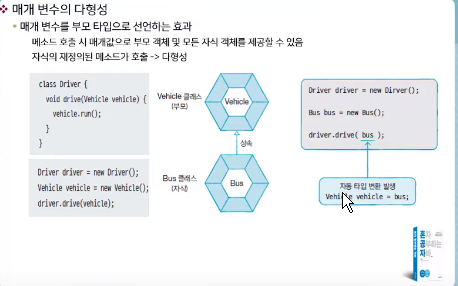

# 2021.02.16

* 메소드 오버라이딩(Overriding)
  * 부모 클래스의 메소드가 자식클래스에서 사용하기 부적합할 경우 자식클래스에서 수정해서 사용
  * 메소드가 재정의될 경우 부모 객체 메소드가 숨겨지며 자식객체에서 메소드 호출하면 재정의된 자식 메소드가 호출됨
  * 접근제한을 더 강하게 재정의할 수 X (ex : 부모 메소드 퍼블릭 오버라이딩한 자식 메소드 디폴트나 private 접근제한으로 수정 불가)

```java
package sec01.exam03;

public class Calculator {
	
	double areaCircle(double r) {
		System.out.println("calculator 객체의 areaCircle() 실행");
		return 3.14159*r*r;
	}

}

```

```java
package sec01.exam03;

public class Computer extends Calculator {
	
	double areaCircle(double r) {
		System.out.println("ㅊomputer 객체의 areaCircle() 실행"); //Calculator의 메소드를 가져와서 재정의한 다음 수정한다
		return Math.PI*r*r;
	}

}

```

```java
package sec01.exam03;

public class ComputerExample {

	public static void main(String[] args) {
		
		int r = 10;
		
		Calculator calculator = new Calculator();
		System.out.println("원면적 : "+calculator.areaCircle(r));
		
		Computer computer = new Computer();
		System.out.println("원면적 : "+computer.areaCircle(r));
		//재정의된 메소드가 온다
	}

}

```


```java
package sec01.exam04;

public class AirPlane {
	public void land() {
		System.out.println("착률합니다.");
	}
	
	public void fly() {
		System.out.println("일반비행합니다.");
	}
	public void takeoff() {
		System.out.println("이륙합니다.");
	}

}

```


```java
package sec01.exam04;

public class SuperSonicAirPlane extends AirPlane {
	public static final int NORMAL = 1;
	public static final int SUPERSONIC = 2;
	
	public int flyMode = NORMAL;
	
	@Override  // Ctrl + Space를 누르면 쉽게 재정의가 가능
	public void fly() {
		if(flyMode == SUPERSONIC) {
			System.out.println("초음속비행합니다.");
		} else {
			//super는 부모의 메소드 호출
			super.fly();
		}
	}
	
	

}

```


```java
package sec01.exam04;

public class SuperSonicAirPlaneExample {

	public static void main(String[] args) {
		
		SuperSonicAirPlane sa = new SuperSonicAirPlane();
		sa.takeoff();
		sa.fly();
		sa.flyMode = SuperSonicAirPlane.SUPERSONIC;
		sa.fly();
		sa.flyMode = SuperSonicAirPlane.NORMAL;
		sa.fly();
		
	}

}

```


* Final 키워드

  * 해당 선언이 최종상태이며 수정할 수 없음

  * 클래스 및 메소드 선언 시 final 키워드를 사용하면 상속과 관련됨

  * Final 클래스는 부모클래스가 될 수 없다

    ```java
    public final class 클래스 {...}
    ```

    클래스는 상속 불가

  * 부모클래스에 선언된 final 메소드는 자식클래스에서 재정의 불가능


* 타입 변환과 다형성 
  * 자동타입변환(promotion)
    * 프로그램 실행 도중 자동으로 타입변환이 일어나는 것


​		

* 부모타입으로 자동타입변환이후에는 부모클래스에 선언된 필드 및 메소드에만 접근 가능
* 예외적으로 메소드가 자식 클래스에서 오버라이딩될 경우 자식 클래스의 메소드가 대신 호출
* 


```java
package sec02.exam02;

public class Parent {
	public void method1() {
		System.out.println("Parent-method1()");
	}
	
	public void method2() {
		System.out.println("Parent-method2()");
	}
}

```

```java
package sec02.exam02;

public class Child extends Parent {
	@Override
	public void method2() {
		System.out.println("Child-method2()");
	}
	
	public void method3() {
		System.out.println("Child-method3()");
	}

}

```

```java
package sec02.exam02;

public class ChildExample {
	
	public static void main(String[] args) {
	
		Child child = new Child();
		
		Parent parent = child;
		
		parent.method1();
		
		parent.method2(); // Child클래스에서 가져온다
		
		child.method3();
		
		//parent.method3() 호출 불가능
	}

}

```


* 필드의 다형성
  * 필드의 다형성 = 재정의(오버라이딩) + 타입변환
  * 다형성 : 동일한 타입을 사용하지만 다양한 결과가 나오는 성질

```java
package sec02.exam03;

public class Tire {
	
	//필드
	public int maxRotation;
	public int accumulatedRotation;
	public String location;
	
	//생성자
	public Tire (String location, int maxRotation) {
		this.location = location;
		this.maxRotation = maxRotation;
	}
	
	//메소드
	public boolean roll() {
		++accumulatedRotation;
		if (accumulatedRotation<maxRotation) {
			System.out.println(location+"Tire 수명: "+(maxRotation-accumulatedRotation)+"회");
			return true;
		} else {
			System.out.println("***"+location+"Tire 펑크***");
			return false;
		}
	}
	
	

}

```


```java
package sec02.exam03;

public class Car {
	
	//필드
	Tire frontLeftTire = new Tire("앞왼쪽", 6);
	Tire frontRightTire = new Tire("앞오른쪽", 2);
	Tire rearLeftTire = new Tire("뒤왼쪽", 3);
	Tire rearRightTire = new Tire("뒤오른쪽",4);
	
	//생성자
	
	//메소드
	int run() {
		System.out.println("자동차가 달립니다.");
		if(frontLeftTire.roll()==false) {
			stop();
			return 1;
		}
		if(frontRightTire.roll()==false) {
			stop();
			return 2;
		}
		if(rearLeftTire.roll()==false) {
			stop();
			return 3;
	    }
		if(rearRightTire.roll()==false) {
			stop();
			return 4;
		}
		return 0;
	}
	
	void stop() {
		System.out.println("자동차가 멈춥니다.");
	}
		

}

```


* 매개 변수의 다형성
* 매개변수 타입이 클래스일 경우 해당 클래스의 객체뿐만 아니라 자식객체까지고 매개값으로 사용할 수 있다.




```java
package sec02.exam04;

public class Vehicle {
	
	//필드
	
	//메소드
	
	public void run() {
		System.out.println("차량이 달립니다.");
	}

}

```

```java
package sec02.exam04;

public class Driver {
	
	public void drive(Vehicle vehicle) {
		vehicle.run();
		
	}

}

```

```java
package sec02.exam04;

public class Bus extends Vehicle {
	@Override
	public void run() {
		System.out.println("버스가 달립니다.");
	}
	
	

}

```

```java
package sec02.exam04;

public class DriverExample {

	public static void main(String[] args) {
		
		Driver driver = new Driver();
		
		Vehicle vehicle = new Vehicle();
		
		driver.drive(vehicle);
		
		Bus bus = new Bus();
		
		driver.drive(bus);
		
		Taxi taxi = new Taxi();
		
		driver.drive(taxi);
		
	}

}

```

```java
차량이 달립니다.
버스가 달립니다.
택시가 달립니다.

```


