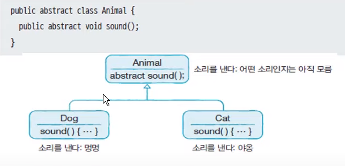
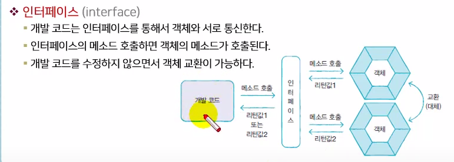
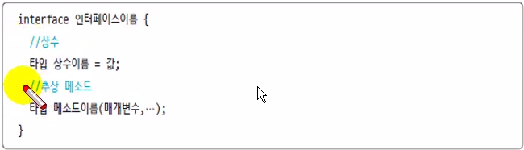
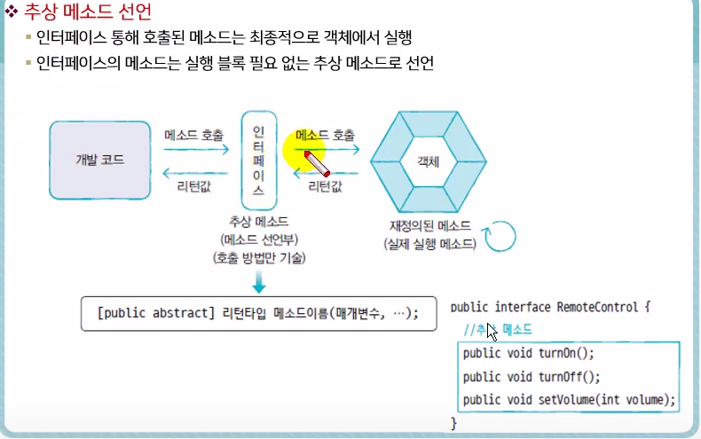
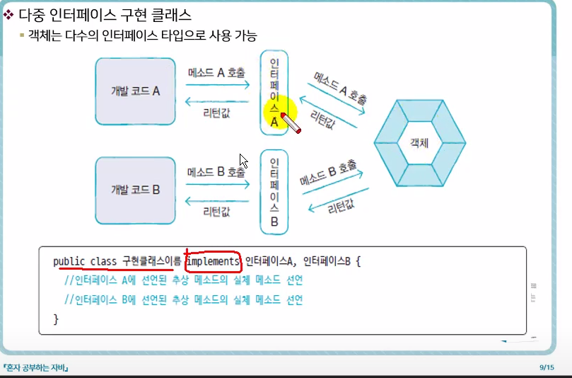
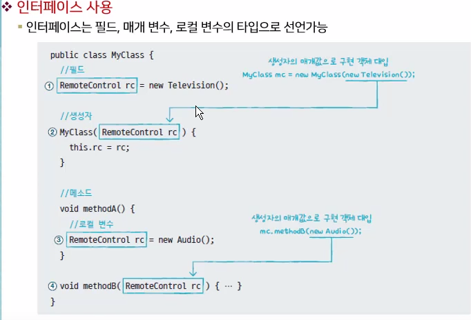
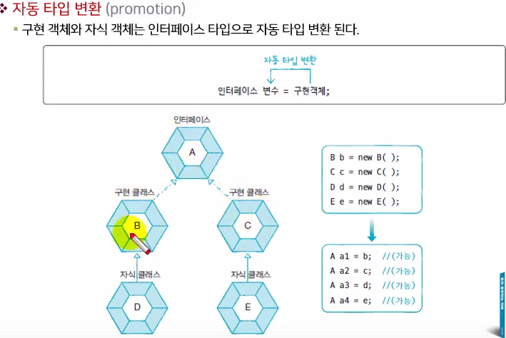

# 2021.02.17

* 추상 클래스
  * 여러 클래스의 공통된 특성(필드.메소드)를 추출해서 선언한 것을 추상클래스라 한다.
  * 

* 추상 클래스의 용도

  * 실체 클래스에 반드시 존재해야 할 필드와 메소드의 선언(실체 클래스의 설계 규격- 객체 생성용이 아님)
  * 실체클래스에는 공통된 내용은 빠르게 물려받고, 다른점만 선언하면 되므로 시간 절약

* 추상클래스 선언

* ```java
  public abstract class 클래스 {
      //필드
      //생성자
      //메소드
  }
  ```

* new 연산자를 이용해서 객체를 만들지 못하고 상속을 통해서만 자식클래스를 만든다.

```java
package sec03.exam01;

public abstract class Phone {
	//필드
	public String owner;
	
	//생성자
	public Phone(String owner) {
		this.owner = owner;
	}
	
	//메소드
	public void turnOn() {
		System.out.println("폰 전원을 켭니다.");
	}
	
	public void turnOff() {
		System.out.println("폰 전원을 끕니다.");
	}

}

```

```java
package sec03.exam01;

public class PhoneExample {

	public static void main(String[] args) {
		
		// Phone phone = new Phone() new 연산자 사용 불가능
		
		SmartPhone smartphone = new SmartPhone("홍길동");
		
		smartphone.turnOn();
		smartphone.internetSearch();
		smartphone.turnOff();
		
	}

}

```

```java
package sec03.exam01;

public class SmartPhone extends Phone {
	//생성자 부모 클래스에 기본생성자가 없고 매개변수가 있는 생성자가 있다면 생성자에서 반드시 부모생성자 호출을 위해 super(매개값,...)를 명시적으로 호출해야 한다.
	public SmartPhone(String owner) {
		super(owner);	
	}
	
	//메소드
	public void internetSearch() {
		System.out.println("인터넷 검색을 합니다.");
	}

}

```


* 추상 메소드

  * 메소드 선언만 동일하고 실행내용은 실체클래스마다 달라야 하는 경우

  * 메소드 선언부만 있고 메소드 실행내용인 { }가 없다

  * 하위클래스는 반드시 재정의해서 실행내용을 채워야함

  * ```java
    public abstract 리턴타입 메소드명(매개변수, ...)
    ```

  * 

```java
package sec03.exam02;

public abstract class Animal {
	
	public String kind;
	
	public void breath() {
		System.out.println("숨을 쉽니다.");
	}
	
	public abstract void sound();

}

```

```java
package sec03.exam02;

public class Dog extends Animal {
	
	public Dog() {
		this.kind = "포유류";
	}
	
	@Override
	public void sound() {
		System.out.println("멍멍");//Animal클래스에 sound메소드 재정의 필요
		
	}
}

```

```java
package sec03.exam02;

public class AnimalExample {

	public static void main(String[] args) {
		
		Dog dog = new Dog();
		Cat cat = new Cat();
		
		dog.sound();
		
		cat.sound();
		
		Animal animal = null;
		
		animal = new Dog();//타입변환
		animal.sound();//재정의된 메소드
		
		animal = new Cat();//타입변환
		animal.sound();
		
		animalSound(new Dog());
		animalSound(new Cat());
	}
	
	public static void animalSound(Animal animal) {
		animal.sound();//재정의된 메소드
	}

}

```


* 인터페이스

  * 인터페이스는 객체의 사용방법을 정의한 타입이다.
  * 인터페이스를 통해 다양한 객체를 동일한 사용방법으로 이용가능
  * 
  * 개발코드는 인터페이스를 통해서 객체와 서로 통신한다,
  * 인터페이스의 메소드 호출하면 객체의 메소드가 호출된다.
  * 개발 코드를 수정하지 않으면서 객체교환이 가능하다.

* 인터페이스 선언

  * ```java
    [public] interface 인터페이스명 {...}
    ```

* 인터페이스는 객체로 생성 불가하므로 생성자를 가질 수 없다.

* 

  인터페이스는 상수필드와 메소드만으로 이루어져 있다.

* 상수이름은 대문자 작성 서로 다른 언어는 _ 언더바로 연결

* 

  


* 구현 클래스

  * 인터페이스에서 정의된 추상메소드를 재정의해서 실행내용을 가지고 있는 클래스

  * 클래스 선언부에 implement키워드를 추가하고 인터페이스 이름 명시

  * ```java
    public class 구현클래스명 implements 인터페이스면 {
        //인터페이스에 선언된 추상메소드의 실체메소드 선언
    }
    ```

  * ```java
    package sec01.exam04;
    
    public interface RemoteControl {
    	//상수
    	/*public static final*/ int MAX_VOLUME = 10;
    	int MIN_VOLUME = 0;
    	
    	//메소드
    	void turnon();
    	void turnoff();
    	void setVolume(int volume);
    }
    
    ```

  * ```java
    package sec01.exam04;
    
    public class Television implements RemoteControl {
    	
    	private int volume;
    	
    	@Override
    	public void turnon() {
    		System.out.println("TV를 켭니다.");
    	}
    
    	@Override
    	public void turnoff() {
    		System.out.println("TV를 끕니다.");
    	}
    
    	@Override
    	public void setVolume(int volume) {
    		if(volume > RemoteControl.MAX_VOLUME) {
    			this.volume = RemoteControl.MAX_VOLUME;
    		} else if(volume < RemoteControl.MIN_VOLUME) {
    			this.volume = RemoteControl.MIN_VOLUME;
    		} else {
    			this.volume = volume;
    		}
    		System.out.println("현재 TV 볼륨 : "+this.volume);
    	}
    
    }
    
    ```

  * ```java
    package sec01.exam04;
    
    public class RemoteControlExample {
    
    	public static void main(String[] args) {
    		
    		RemoteControl rc;
    		
    		rc = new Television();
    		//rc = new Audio();도 가능
    		//메소드호출코드는 똑같은데 어떤 객체가 대입이 됐냐에 따라 결과가 다름
    		
    		rc.turnon();
    		rc.setVolume(5);
    		rc.turnoff();
    		
    	}
    
    }
    
    ```

* 다중 인터페이스 구현 클래스

  * 


```java
package sec01.exam05;

public interface Searchable {
	void search(String url);

}

```

```java
package sec01.exam05;

import sec01.exam04.RemoteControl;

public class SmartTelevision implements Searchable, sec01.exam05.RemoteControl {
	
	private int volume;
	
	@Override
	public void search(String url) {
		System.out.println(url+"을 검색합니다.");
	}

	@Override
	public void turnon() {
		System.out.println("TV를 켭니다.");
	}

	@Override
	public void turnoff() {
		System.out.println("TV를 끕니다.");
	}

	@Override
	public void setVolume(int volume) {
		if(volume > RemoteControl.MAX_VOLUME) {
			this.volume = RemoteControl.MAX_VOLUME;
		} else if(volume < RemoteControl.MIN_VOLUME) {
			this.volume = RemoteControl.MIN_VOLUME;
		} else {
			this.volume = volume;
		}
		System.out.println("현재 TV 볼륨 : "+this.volume);
	}

}

```

```java
package sec01.exam05;

public class SmartTelevisionExample {

	public static void main(String[] args) {

		SmartTelevision tv = new SmartTelevision();
		
		
		RemoteControl rc = tv;
		rc.turnoff();
		rc.setVolume(5);
		rc.turnoff();
		
		
		Searchable searchable = tv;
		searchable.search("http://www.naver.com");
	}

}

```


* 인터페이스 사용
  * 인터페이스로 구현객체를 사용하려면 인터페이스 변수를 선언하고 구현객체를 대입
  * 

```java
package sec01.exam06;

public interface RemoteControl {
	//상수
	/*public static final*/ int MAX_VOLUME = 10;
	int MIN_VOLUME = 0;
	
	//메소드
	void turnon();
	void turnoff();
	void setVolume(int volume);
}

```

```java
package sec01.exam06;

public class Television implements RemoteControl {
	
	private int volume;
	
	@Override
	public void turnon() {
		System.out.println("TV를 켭니다.");
	}

	@Override
	public void turnoff() {
		System.out.println("TV를 끕니다.");
	}

	@Override
	public void setVolume(int volume) {
		if(volume > RemoteControl.MAX_VOLUME) {
			this.volume = RemoteControl.MAX_VOLUME;
		} else if(volume < RemoteControl.MIN_VOLUME) {
			this.volume = RemoteControl.MIN_VOLUME;
		} else {
			this.volume = volume;
		}
		System.out.println("현재 TV 볼륨 : "+this.volume);
	}

}

```

```java
package sec01.exam06;

public class Audio implements RemoteControl {
	
	private int volume;
	
	@Override
	public void turnon() {
		System.out.println("Audio를 켭니다.");
	}

	@Override
	public void turnoff() {
		System.out.println("Audio를 끕니다.");
	}

	@Override
	public void setVolume(int volume) {
		if(volume > RemoteControl.MAX_VOLUME) {
			this.volume = RemoteControl.MAX_VOLUME;
		} else if(volume < RemoteControl.MIN_VOLUME) {
			this.volume = RemoteControl.MIN_VOLUME;
		} else {
			this.volume = volume;
		}
		System.out.println("현재 Audio 볼륨 : "+this.volume);
	}

}

```

```java
package sec01.exam06;

public class MyClass {
	//필드
	RemoteControl rc = new Television();
	
	//생성자
	MyClass(){

	}
	
	MyClass(RemoteControl rc) {
		this.rc = rc;
		rc.turnon();
		rc.setVolume(5);
		rc.turnoff();
	}
	//메소드
	void methodA() {
		RemoteControl rc = new Audio();
		rc.turnon();
		rc.setVolume(5);
	}
	
	void methodB(RemoteControl rc) {
		rc.turnon();
		rc.setVolume(5);
	}

}

```

```java
package sec01.exam06;

public class MyClassExample {

	public static void main(String[] args) {

		System.out.println("1)--------------------");
		
		MyClass myClass1 = new MyClass();
		myClass1.rc.turnon();
		myClass1.rc.setVolume(5);
		
		System.out.println("2)--------------------");
		
		MyClass myClass2 = new MyClass(new Audio());
		myClass2.rc.turnoff();
		
		System.out.println("3)--------------------");
		MyClass myClass3 = new MyClass();
		myClass3.methodA();
		
		System.out.println("4)--------------------");
		MyClass myClass4 = new MyClass();
		myClass4.methodB(new Television());
	}

}

```

```java
1)--------------------
TV를 켭니다.
현재 TV 볼륨 : 5
2)--------------------
Audio를 켭니다.
현재 Audio 볼륨 : 5
Audio를 끕니다.
Audio를 끕니다.
3)--------------------
Audio를 켭니다.
현재 Audio 볼륨 : 5
4)--------------------
TV를 켭니다.
현재 TV 볼륨 : 5

```

* 자동 타입 변환
  * 구현 객체와 자식객체는 인터페이스 타입으로 자동타입변환된다.
  * 