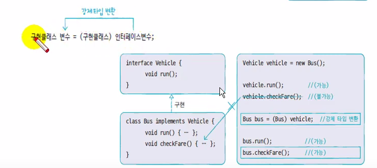
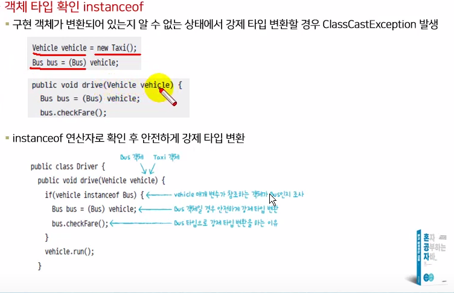
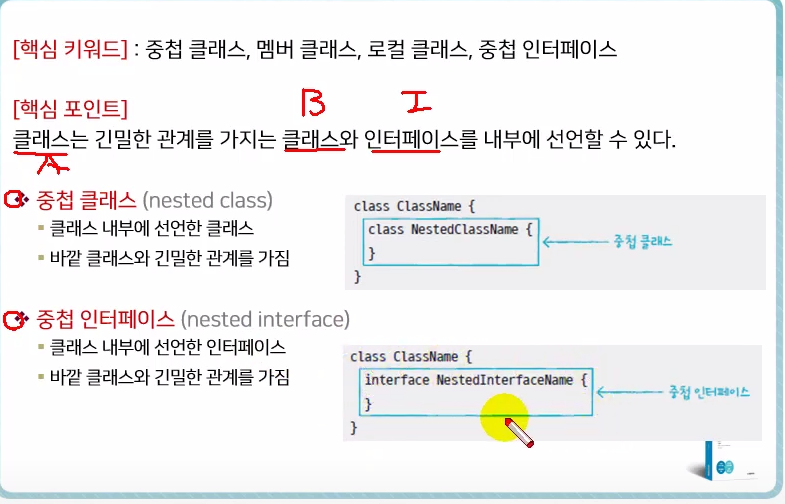
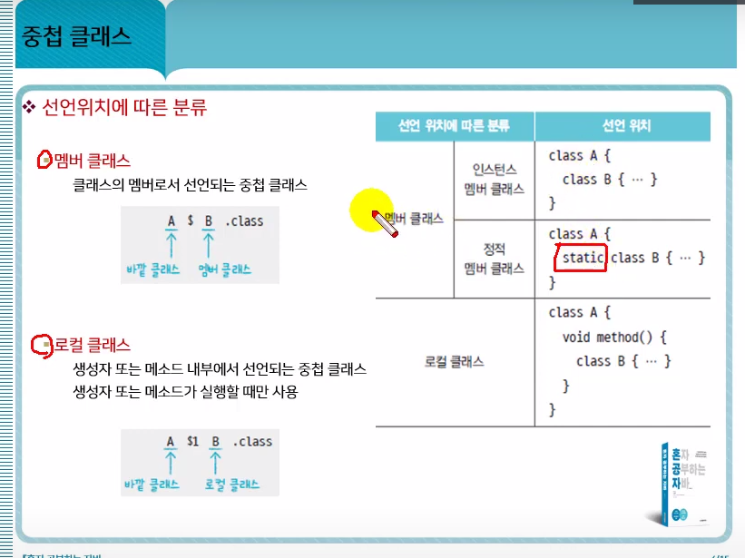
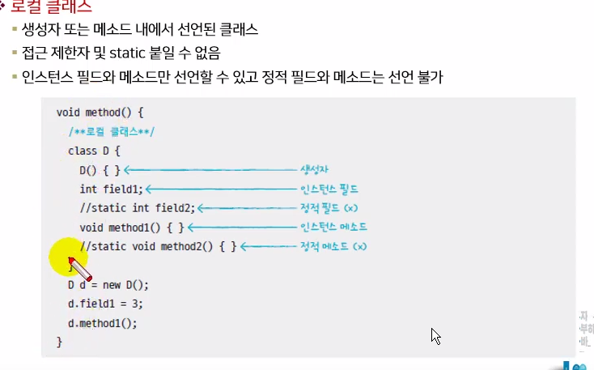
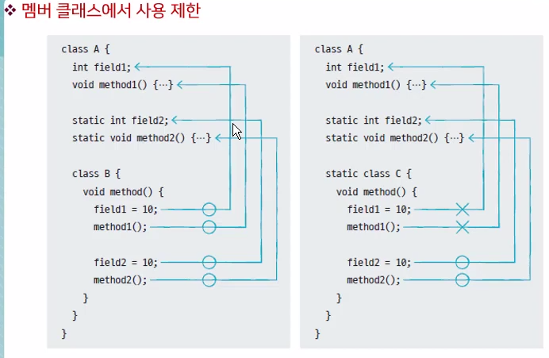

# 2021.02.18

* 매개변수의 다형성

  * ```java
    package sec02.exam02;
    
    public interface Vehicle {
    	public void run();
    
    }
    
    ```

  * ```java
    package sec02.exam02;
    
    public class Driver {
    	public void drive(Vehicle vehicle) {//인터페이스타입을 매개변수로 설정
    		vehicle.run();
    	}
    
    }
    
    ```

  * ```java
    package sec02.exam03;
    
    public class Bus implements Vehicle {
    
    	@Override
    	public void run() {
    		System.out.println("버스가 달립니다.");
    	}
    	
    	public void checkFare() {
    		System.out.println("승차요금을 체크합니다.");
    	}
    
    }
    
    ```

  * ```java
    package sec02.exam02;
    
    public class DriverExample {
    
    	public static void main(String[] args) {
    		Driver driver = new Driver();
    		
    		Bus bus = new Bus();
    		Taxi taxi = new Taxi();
    		
    		driver.drive(bus);//drive 메소드가 인터페이스타입을 매개변수로 선언하였기에 어떤 구현객체를 넣어도 된다.
    		driver.drive(new taxi());
    	}
    
    }
     
    ```

* 강제 타입 변환

  * 구현객체가 인터페이스타입으로 자동변환되면 인터페이스에 선언된 메소드만 사용 가능

  * 구현클래스에만 선언된 필드나 메소드를 사용할 경우 강제 타입 변환

  * 

  * ```java
    구현클래스 변수 = (구현클래스) 인터페이스 변수;
    ```

  * ```java
    package sec02.exam03;
    
    public class VehicleExample {
    
    	public static void main(String[] args) {
    		Vehicle vehicle = new Bus();
    		
    		vehicle.run();
    		
    		Bus bus = (Bus) vehicle;// Bus에만 있는 메소드를 호출하기 위해 타입변환이 필요 
    		bus.checkFare();
    	}
    
    }
    
    ```


* 객체타입 확인

  * 

  * Taxi객체가 인터페이스 변환되어 있을 경우 Bus타입으로 강제타입변환하면 classcastexception이 발생한다.

  * ```java
    package sec02.exam04;
    
    public class Driver {
    	public void drive(Vehicle vehicle) {
    		if(vehicle instanceof Bus) {// 인터페이스타입으로 변환된 객체가 Bus인지 확인
    			Bus bus = (Bus) vehicle;
    			bus.checkFare();
    		}
    		vehicle.run();
    	}
    
    }
    
    ```

* 인터페이스 상속

  * 인터페이스는 다중상속을 허용한다.

  * ```java
    package sec02.exam05;
    
    public class ImplementationC implements InterfaceC {
    	// C가 갖고 있는 메소드C뿐만 아니라 C가 상속한 메소드 A,B도 딸려온다.
    	@Override
    	public void methodA() {
    		System.out.println("ImplementationC -methodA() 실행");
    	}
    
    	@Override
    	public void methodB() {
    		System.out.println("ImplementationC -methodB() 실행");
    	}
    
    	@Override
    	public void methodC() {
    		System.out.println("ImplementationC -methodC() 실행");
    	}
    
    }
    
    ```

  * 

  * ```java
    package sec02.exam05;
    
    public class Example {
    
    	public static void main(String[] args) {
    		
    		ImplementationC imp1 = new ImplementationC();
    		
    		InterfaceA ia = imp1;
    		ia.methodA(); //인터페이스A에는 메소드 A만 들어있어 ia로는 메소드A만 호출
    		
    		InterfaceB ib = imp1;
    		ib.methodB();
    		
    		InterfaceC ic = imp1;// 메소드 abc 다 가능
    		ic.methodA();
    		ic.methodB();
    		ic.methodC();
    		
    	}
    
    }
    
    ```

  * 


* 중첩 클래스
  * 클래스는 긴밀한 관계를 가지는 클래스와 인터페이스를 내부에 선언할 수 있다.
  * 
  * 
  * 인스턴스멤버 클래스  : A 객체를 생성해야만 사용할 수 있는 B중첩 클래스
  * 정적 멤버 클래스         : A클래스로 바로 접근할 수 있는 B중첩 클래스
  * 로컬 클래스                 : 메소드 가 실행할 때만 사용할 수 있는 B중첩클래스


* 인스턴스 멤버 클래스와 정적멤버클래스

  * ```java
    package sec01.exam01;
    
    public class A {
    	A() {
    		System.out.println("A 객체가 생성됨");
    	}
    	
    	class B {
    		B(){
    			System.out.println("B 객체가 생성됨");
    		}
    		int field1;
    		// static int field2; 인스턴스멤버 내에서는 정적필드와 메소드선언 불가
    		void method() {
    			
    		}
    		//static void methodB() {}
    	}
    	
    	static class C {
    		C(){
    			System.out.println("C 객체가 생성됨");
    		}
    		int field1;
    		static int field2;
    		void method1() {}
    		static void method2() {}
    	}
    	
    	void method() {
    		class D{//로컬클래스(메소드 안 클래스)
    			D(){
    				System.out.println("D 객체가 생성됨");
    			}
    		int field1;
    		//static int field2 로컬 클래스 안에서 불가능
    		void method1() {}
    		//static void method2() {}
    		}
    		
    		D d = new D();
    		d.field1 = 3;
    		d.method1();
    		
    	}
    
    }
    
    ```

  * ```java
    package sec01.exam01;
    
    public class Main {
    
    	public static void main(String[] args) {
    		A a = new A();//A 객체를 먼저 생성
    		
    		A.B b = a.new B();
    		b.field1 = 3;
    		b.method();
    		
    		
    		A.C c = new A.C();// C객체를 생성할 필요가 없다
    		c.field1 = 3;
    		c.method1();
    		
    		A.C.field2 = 3; //  정직필드이기 때문에 생성자 c없이 클래스 이름만으로도 접근 가능
    		A.C.method2();
    		
    		a.method();//메소드를 실행하면서 D 객체 생성
    		
    		
    	}
    
    }
    
    ```

* 로컬 클래스

  * 중첩클래스는 메소드 내에서도 선언 가능
  * 로컬클래스는 접근데한자(piblic, private)및 static을 붙일 수 없다.
  * 

  

* 멤버클래스에서 사용제한

  * 


* 로컬클래스에서 사용제한 

  * 로컬클래스에서 사용하는 매개변수나 로컬변수의 값을 final로 선언해서 수정을 막는다. 

  * ```java
    package sec01.exam04;
    
    public class Outter {
    	public void method1(int arg) {
    		int localVariable = 1;
    		
    		//arg = 100; arg,localVariable은 final특성을 갖는다.
    		//localVariable = 100;
    		
    		class Inner {
    			void method() {
    				int result = arg + localVariable;
    			}
    		}
    	}
    
    }
    
    ```

* 중첩클래스에서 바깥 클래스참조 얻기

  * 바깥 클래스의 이름을 this 앞에 붙임

  * ```java
    바깥클래스.this.필드
    바깥클래스.this.메소드()
    ```

  * ```java
    package sec01.exam05;
    
    public class Outter {
    	String field = "Outer - field";
    	void method() {
    		System.out.println("Outer - method");
    	}
    	
    	class Nested {
    		String field = "Nested - field";
    		void method() {
    			System.out.println("Nested - method");
    		}
    		
    		void print() {
    			System.out.println(this.field);// this가 Nested클래스를 참조한다. 
    			this.method();
    			
    			System.out.println(Outter.this.field);//Outter클래스의 객체를 참조
    			Outter.this.method();//바깥클래스 객체를 불러온다.
    		}
    	}
    
    }
    
    ```

  * ```java
    package sec01.exam05;
    
    public class OutterExample {
    
    	public static void main(String[] args) {
    		Outter outter = new Outter();
    		Outter.Nested nested = outter.new Nested();
    		nested.print();
    	}
    
    }
    
    ```

  * ```java
    Nested - field
    Nested - method
    Outer - field
    Outer - method
    
    ```


* 중첩 인터페이스

  * ```java
    package sec01.exam06;
    
    public class Button {
    	OnClickListener listener;
    	
    	void setListener(OnClickListener listener) {
    		this.listener = listener;
    	}
    	
    	void click() {
    		listener.onClick();
    	}
    	
    	static interface OnClickListener {
    		void onClick();
    	}
    
    }
    
    ```

  * ```java
    package sec01.exam06;
    
    public class CallListener implements Button.OnClickListener {
    
    	@Override
    	public void onClick() {
    		System.out.println("전화를 겁니다.");
    	}
    
    }
    
    ```

  * ```java
    package sec01.exam06;
    
    public class ButtonExample {
    
    	public static void main(String[] args) {
    
    		Button btn1 = new Button();
    		btn1.setListener(new CallListener());
    		btn1.click();
    		
    		Button btn2 = new Button();
    		btn2.setListener(new MessageListener());
    		btn2.click();
    		
    	}
    
    }
    
    ```

  * 

