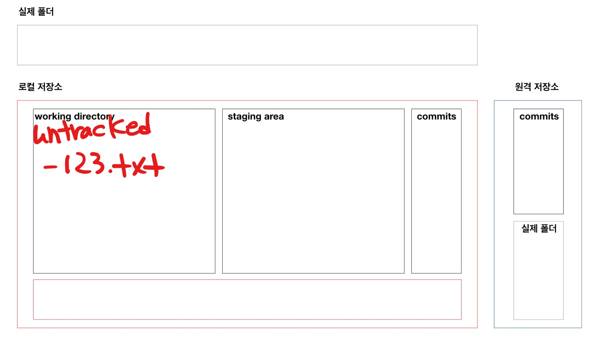
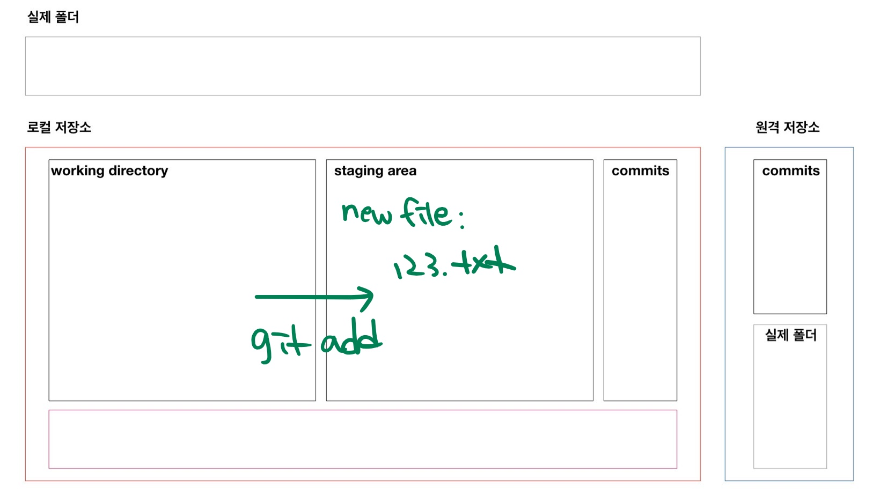
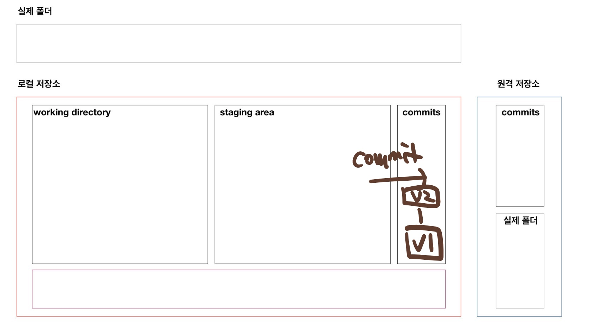
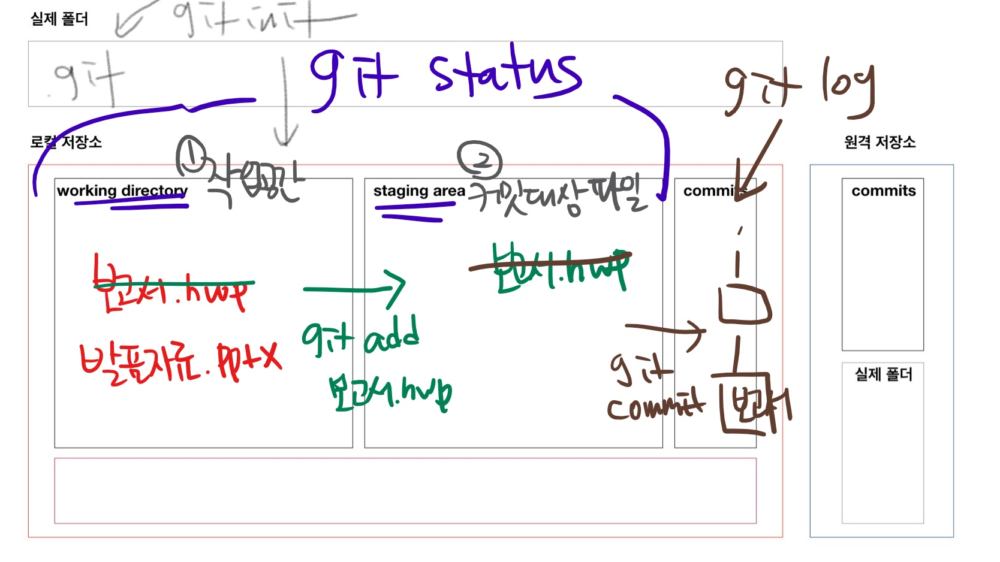

# git 기초

> 분산버전관리시스템(DVCS)

## git 저장소(repository) 초기화

```bash
$ git init
Initialized empty Git repository in C:/Users/student/Desktop/md/.git/
(master) $
```

* `.git` 숨김 폴더가 생성되고, bash 환경에서는 `(master)` 로 브랜치 정보가 나타난다.

## 작업 흐름

### 1. `add`

```bash
$ git add .              # . 현재디렉토리!
$ git add a.txt b.txt    # 특정 파일
$ git add myfolder/      # 특정 폴더
```

현재 작업 중인 파일의 변경사항을 `staging area` 로 변경한다.

* staging area : 커밋(버전)으로 기록할 대상의 파일들의 목록

add 전 상황

```bash
$ touch 123.txt
$ git status
On branch master

No commits yet
# untracked files - 트래킹이 되고 있지 않는 파일
# 첫번째 통
Untracked files:
  # git add를 사용
  # 커밋이 될 것에 포함시키기 위해서..
  # 두번째 통으로 이동시키려면
  (use "git add <file>..." to include in what will be committed)
        123.txt

nothing added to commit but untracked files present (use "git add" to track)

```



* add 후 상황

  ```bash
  $ git add .
  $ git status
  On branch master
  
  No commits yet
  # 커밋이 될 변경사항들
  Changes to be committed:
    (use "git rm --cached <file>..." to unstage)
          new file:   123.txt
  
  ```



### 2. commit

> 변경사항들을 버전으로 기록

```bash
$ git commit -m 'First commit'
[master (root-commit) d38cbcd] First commit
 1 file changed, 0 insertions(+), 0 deletions(-)
 create mode 100644 123.txt
```

* 특정시점을 스냅샷처럼 기록한다.
* commit시 메시지는 반드시 잘 작성해야한다.
  * 지금 기록한 코드의 이력을 나타낼 수 있도록



## 기타 명령어

### `log`

>  지금까지 기록된 커밋들을 확인할 수 있음

```bash
$ git log
commit d38cbcdb19140f2ca0d83ba9f59f6cb6cfd02c24 (HEAD -> master)
Author: edutak <edutak.ssafy@gmail.com>
Date:   Thu Feb 4 14:12:49 2021 +0900

    First commit
$ git log --oneline # 한줄로
d38cbcd (HEAD -> master) First commit
$ git log -2     # 최근 2개
$ git log --oneline -1 # 최근 1개를 한줄로
```

### `status`

> git 저장소의 파일 변경 사항등을 확인할 수 있음

```bash
$ git status
On branch master
nothing to commit, working tree clean
```

