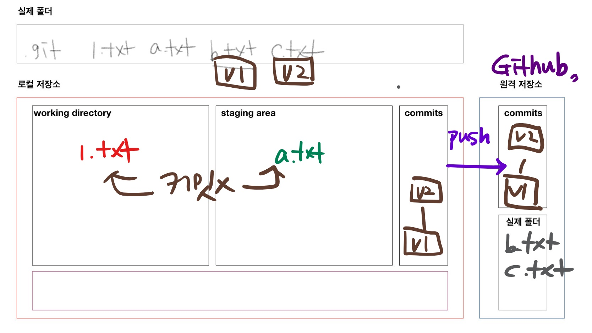

# 원격저장소 기초 활용

* github을 기준으로 설명하지만, 원격저장소를 제공하는 서비스는 gitlab, bitbucket 등 많다.

## 준비

* github에서 새로운 원격저장소 만들기

## 원격 저장소 설정

```bash
$ git remote add origin __주소__
```

* git 원격저장소(`remote`)를 추가(`add`)해줘. `origin` 이라는 이름으로 `주소`를 

* 원격 저장소 확인을 위해서는 아래의 명령어를 사용한다.

  ```bash
  $ git remote -v
  # origin은 ~~주소다!
  origin  https://github.com/edutak/first.git (fetch)
  origin  https://github.com/edutak/first.git (push)
  ```

* 원격 저장소 삭제(`rm`)를 하기 위해서는 아래의 명령어를 사용한다.

  ```bash
  $ git remote rm origin
  ```

## push

```bash
$ git push origin master
```

* `origin` 으로 지정된 곳에 `master` 브랜치 push
* 