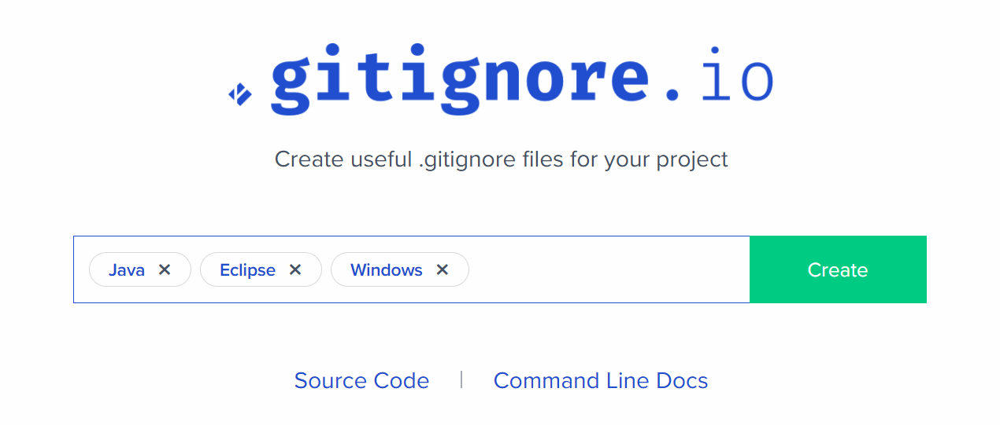

# gitignore

> git으로 추적하지 않는 파일들을 지정

```
data.csv # 특정 파일
secret/  # 특정 폴더
*.pptx   # 특정 확장자

```

* 일반적으로 개발 환경(`OS` , IDE(통합개발환경 - Eclipse), 텍스트에디터(vscode))에 관한 내용과 특정 언어 혹은 프레임워크에서 생성된 소스코드와 상관 없는 파일들을 지정한다.
  * 처음에는 http://gitignore.io/  혹은 https://github.com/github/gitignore 원하는 내용을 입력해서 나온 결과를 활용하자.
    * 예) 
  * 여기에, 본인이 희망하는 파일을 추가하면 된다.