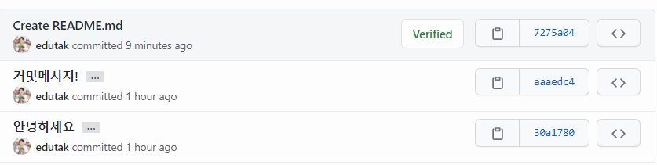
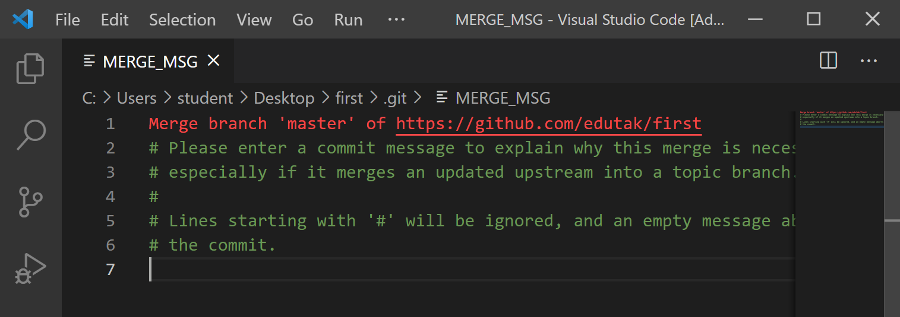

# git remote error

```bash
$ git push origin master
To https://github.com/edutak/first.git
# 거절됨.
 ! [rejected]        master -> master (fetch first)
error: failed to push some refs to 'https://github.com/edutak/first.git'
# 왜냐하면.. 원격저장소가 가진 작업(커밋)
hint: Updates were rejected because the remote contains work that you do
# 로컬에(locally) 가지고 있지 않다.
# 원격저장소 커밋 히스토리 != 로컬 커밋 히스토리
hint: not have locally. This is usually caused by another repository pushing
# 너는 원할것...
# 원격저장소의 변경사항들(remote changes) 먼저(first) 통합하는 것을
# 다시 push하기 전에!
hint: to the same ref. You may want to first integrate the remote changes
# 예를 들면... git pull...
hint: (e.g., 'git pull ...') before pushing again.
hint: See the 'Note about fast-forwards' in 'git push --help' for details.
```

* 상황 이해

  * 로컬

    ```bash
    $ git log --oneline
    66986f7 (HEAD -> master) Delete images # 로컬!
    aaaedc4 (origin/master) 커밋메시지!
    30a1780 안녕하세요
    ```

  * 원격

    

* 해결

  * pull

  ```bash
  $ git pull origin master
  remote: Enumerating objects: 4, done.
  remote: Counting objects: 100% (4/4), done.
  remote: Compressing objects: 100% (3/3), done.
  remote: Total 3 (delta 1), reused 0 (delta 0), pack-reused 0
  Unpacking objects: 100% (3/3), 720 bytes | 120.00 KiB/s, done.
  From https://github.com/edutak/first
   * branch            master     -> FETCH_HEAD
     aaaedc4..7275a04  master     -> origin/master
  hint: Waiting for your editor to close the filMerge made by the 'recursive' strategy.
   README.md | 5 +++++
   1 file changed, 5 insertions(+)
   create mode 100644 README.md
  ```
  * 병합 커밋 발생

  

  * push

  ```bash
  $ git push origin master
  Enumerating objects: 6, done.
  Counting objects: 100% (6/6), done.
  Delta compression using up to 12 threads
  Compressing objects: 100% (4/4), done.
  Writing objects: 100% (4/4), 467 bytes | 467.00 KiB/s, done.
  Total 4 (delta 2), reused 0 (delta 0), pack-reused 0
  remote: Resolving deltas: 100% (2/2), completed with 2 local objects.
  To https://github.com/edutak/first.git
     7275a04..702f712  master -> master
  ```

  ```bash
  $ git log --oneline
  702f712 (HEAD -> master, origin/master) Merge branch 'master' of https://github.com/edutak/first
  66986f7 Delete images
  7275a04 Create README.md
  ```

  