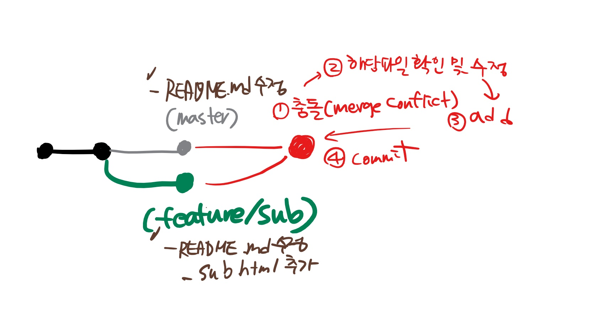

### 상황 1. fast-foward => 프리라이딩

> fast-foward는 feature 브랜치 생성된 이후 master 브랜치에 변경 사항이 없는 상황

1. feature/main branch 생성 및 이동

   ```bash
   $ git branch feature/main
   $ git branch
     feature/main
   * master
   (master) $ git checkout feature/main
   Switched to branch 'feature/main'
   (feature/main) $
   ```

2. 작업 완료 후 commit

   ```bash
   $ touch main.html
   $ git add .
   $ git commit -m 'Complete main'
   $ git log --oneline
   54d238a (HEAD -> feature/main) Complete main
   423a16c (master) Add gitignore
   3f11274 Add README.md
   ```


3. master 이동

   ```bash
   $ git checkout master
   $ git log --oneline
   423a16c (HEAD -> master) Add gitignore
   3f11274 Add README.md
   ```


4. master에 병합

   ```bash
   (master) $ git merge feature/main
   Updating 423a16c..54d238a
   Fast-forward
    main.html | 0
    1 file changed, 0 insertions(+), 0 deletions(-)
    create mode 100644 main.html
   ```


5. 결과 -> fast-foward (단순히 HEAD를 이동)

   ```bash
   $ git log --oneline
   54d238a (HEAD -> master, feature/main) Complete main
   423a16c Add gitignore
   3f11274 Add README.md
   ```

6. branch 삭제

   ```bash
   $ git branch -d feature/main
   Deleted branch feature/main (was 54d238a).
   ```


---

### 상황 2. merge commit (보고서/PPT)

> 서로 다른 이력(commit)을 병합(merge)하는 과정에서 다른 파일이 수정되어 있는 상황
>
> git이 auto merging을 진행하고, commit이 발생된다.

1. feature/about branch 생성 및 이동

   ```bash
   $ git checkout -b feature/about
   Switched to a new branch 'feature/about'
   (feature/about) $
   ```

2. 작업 완료 후 commit

   ```bash
   $ touch about.html
   $ git add .
   $ git commit -m 'Complete about'
   $ git log --oneline
   e44ae26 (HEAD -> feature/about) Complete about
   54d238a (master) Complete main
   423a16c Add gitignore
   3f11274 Add README.md
   ```

3. master 이동

   ```bash
   $ git checkout master
   ```

4. *master에 추가 commit 이 발생시키기!!*

   * **다른 파일을 수정 혹은 생성하세요!**

   ```bash
   $ touch hotfix.html
   $ git add .
   $ git commit -m 'Hotfix'
   $ git log --oneline
   aaa7fe3 (HEAD -> master) Hotfix!!
   54d238a Complete main
   423a16c Add gitignore
   3f11274 Add README.md
   ```

   

5. master에 병합

   ```bash
   $ git merge feature/about
   ```

6. 결과 -> 자동으로 *merge commit 발생*

   

   * vim 편집기 화면이 나타납니다.
   * 자동으로 작성된 커밋 메시지를 확인하고, `esc`를 누른 후 `:wq`를 입력하여 저장 및 종료를 합니다.
      * `w` : write
      * `q` : quit
   * 커밋이  확인 해봅시다.

7. 그래프 확인하기

   ```bash
   $ git log --oneline --graph
   *   775847a (HEAD -> master) Merge branch 'feature/about'
   |\
   | * e44ae26 (feature/about) Complete about
   * | aaa7fe3 Hotfix!!
   |/
   * 54d238a Complete main
   * 423a16c Add gitignore
   * 3f11274 Add README.md
   
   ```

8. branch 삭제

   ```bash
   $ git branch -d feature/about
   ```


---

### 상황 3. merge commit 충돌 (같은 파일 수정)

> 서로 다른 이력(commit)을 병합(merge)하는 과정에서 **동일 파일이 수정**되어 있는 상황
>
> git이 auto merging을 하지 못하고, 해당 파일의 위치에 라벨링을 해준다.
>
> 원하는 형태의 코드로 직접 수정을 하고 merge commit을 발생 시켜야 한다.

1. feature/sub branch 생성 및 이동

   ```bash
   $ git checkout -b feature/sub
   ```

2. 작업 완료 후 commit

   ```bash
   # README파일 수정!
   $ touch sub.html
   $ git status
   On branch feature/sub
   Changes not staged for commit:
     (use "git add <file>..." to update what will be committed)
     (use "git restore <file>..." to discard changes in working directory)
     		# master에서 수정할 예정
           modified:   README.md
   
   Untracked files:
     (use "git add <file>..." to include in what will be committed)
     		# 새로 추가
           sub.html
   
   no changes added to commit (use "git add" and/or "git commit -a")
   $ git commit -m 'Update README and Complete sub'
   ```
   
   ```bash
   $ git log --oneline
   7a54701 (HEAD -> feature/sub) Update README and Complete sub
   775847a (master) Merge branch 'feature/about'
   aaa7fe3 Hotfix!!
   e44ae26 Complete about
   54d238a Complete main
   423a16c Add gitignore
   3f11274 Add README.md
   ```


3. master 이동

   ```bash
   $ git checkout master
   ```


4. *master에 추가 commit 이 발생시키기!!*

   * **동일 파일을 수정 혹은 생성하세요!**

   ```bash
   # README 수정
   $ git status
   On branch master
   Changes not staged for commit:
     (use "git add <file>..." to update what will be committed)
     (use "git restore <file>..." to discard changes in working directory)
           modified:   README.md
   
   no changes added to commit (use "git add" and/or "git commit -a")
   $ git add .
   $ git commit -m 'Update README'
   $ git log --oneline
   8982df8 (HEAD -> master) Update README
   775847a Merge branch 'feature/about'
   aaa7fe3 Hotfix!!
   e44ae26 Complete about
   54d238a Complete main
   423a16c Add gitignore
   3f11274 Add README.md
   ```

5. master에 병합

   ```bash
   $ git merge feature/sub
   # README.md를 자동으로 병합중....
   Auto-merging README.md
   # 충돌!!!!!!!
   # README.md merge conflict!
   CONFLICT (content): Merge conflict in README.md
   # conflict를 고치고 결과를 커밋해!
   Automatic merge failed; fix conflicts and then commit the result.
   (master|MERGING) $
   ```


6. 결과 -> *merge conflict발생*

   


7. 충돌 확인 및 해결

   ```bash
   <<<<<<< HEAD
   # README
   
   * main
   * hotfix
   * about
   =======
   # 웹 프로젝트
   
   * sub
   >>>>>>> feature/sub
   ```
   
   ```bash
   $ git status
   On branch master
   You have unmerged paths.
     (fix conflicts and run "git commit")
     (use "git merge --abort" to abort the merge)
   
   Changes to be committed:
           new file:   sub.html
   
   Unmerged paths:
     (use "git add <file>..." to mark resolution)
           both modified:   README.md
   
   ```


8. merge commit 진행

    ```bash
    $ git commit
    ```

   * vim 편집기 화면이 나타납니다.
   
   * 자동으로 작성된 커밋 메시지를 확인하고, `esc`를 누른 후 `:wq`를 입력하여 저장 및 종료를 합니다.
      * `w` : write
      * `q` : quit
      
   * 커밋이  확인 해봅시다.
   
9. 그래프 확인하기

    ```bash
   $ git log --oneline --graph
   *   20e84fc (HEAD -> master) Merge branch 'feature/sub'
   |\
   | * 7a54701 (feature/sub) Update README and Complete sub
   * | 8982df8 Update README
   |/
   *   775847a Merge branch 'feature/about'
   |\
   | * e44ae26 Complete about
   * | aaa7fe3 Hotfix!!
   |/
   * 54d238a Complete main
   * 423a16c Add gitignore
   * 3f11274 Add README.md
   ```


10. branch 삭제

    ```bash
    $ git branch -d feature/sub
    ```
    
    

