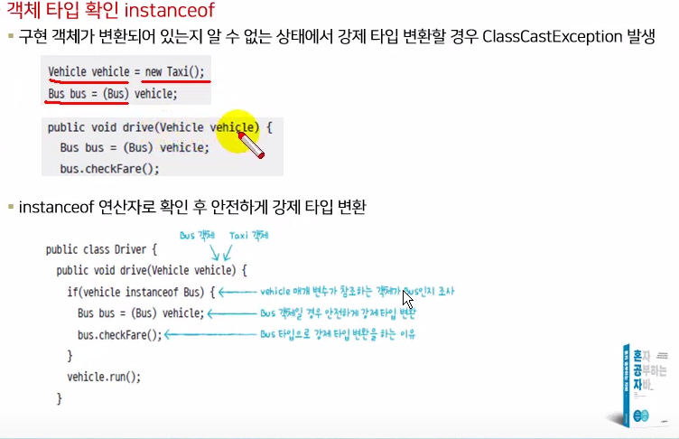
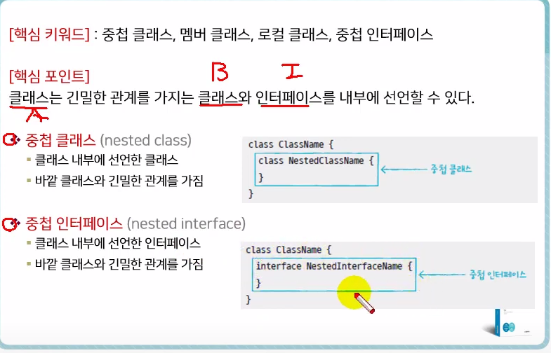
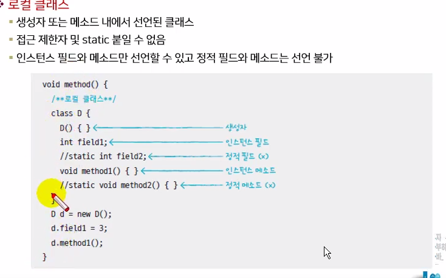

# 2020.02.08

* S 전자 회사는 사회 환원을 목적으로 누구나 활용할 수 있는 오픈 도서관을 운영하고자 한다.  이 도서관의 도서나 잡지들을 관리하기 위한 프로그램을 구현하고자 한다.

1. Book 정보를 저장할 클래스에 생성자와 Encapsulation을 적용하여  생성

​      ( isbn, title, author, publisher, price, desc )

2. Book 클래스가 가지고 있는 정보를 문자열로 리턴 시켜주는 toString() 작성

3. Magazine 정보를 저장할 클래스에 생성자와 Encapsulation을 적용하여 생성

​      ( isbn, title, author, publisher, price, desc, year, month )

4. Magazine 클래스가 가지고 있는 정보를 문자열로 리턴 시켜주는  toString() 작성

5. Book 과 Magazine 을  객체 생성할  BookTest 클래스 작성. BookTest 결과 화면이 다음과 같이 출력되도록 Book 클래스와 Magazine 클래스를 객체 생성하여 toString()를 호출하는 main()를 작성하세요.

* book 클래스

```java
package project2;

public class book {
	//Field
	
	private String isbn;
	private String title;
	private String author;
	private String publisher = "Jean.kr";
	private int price;
	private String desc;
	
	//constructor
	
	book(String isbn, String title, String author, int price, String desc){
		this.isbn = isbn;
		this.title = title;
		this.author = author;
		this.price = price;
		this.desc = desc;
	}
	
	//Method
	
	@Override
	public String toString() {
		return isbn + "   | " + title + "   |" + author + "   |" + publisher
				+ "   |" + price + "   |" + desc;
	}
	
	
}

```

* Magazine 클래스

```java
package project2;

public class Magazine {
	//Field
	
	private String isbn;
	private String title;
	private String author = "편집부";
	private String publisher = "Jean.kr";
	private int price;
	private String desc;
	private int year;
	private int month;
	
	//constructor
	
	public Magazine(String isbn, String title, int price, String desc, int year, int month){
		this.isbn = isbn;
		this.title = title;
		this.price = price;
		this.desc = desc;
		this.year = year;
		this.month = month;
	}
	
	//Method
	@Override
	public String toString() {
		return isbn + "   | " + title + "   | " + author + "   | " + publisher
				+ "   | " + price + "   | " + desc + "   | " + year + "." + month;
	}
	
	
	
	
}
```


* 메인 메소드

```java
package project2;

public class BookTest {

	public static void main(String[] args) {
		book[] getbook = new book [5];
		
		getbook[0] = new book("21424", "Java Basic", "김하나", 15000, "Java 기본 문법");
		getbook[1] = new book("33455", "JDBC Pro", "김철수", 23000, "");
		getbook[2] = new book("55355", "Servlet/JSP", "박자바", 41000, "Model2 기반");
		getbook[3] = new book("35332", "Android App", "홍길동", 25000, "Lightweight Framework");
		getbook[4] = new book("35355", "OOAD 분석,설계", "소나무", 30000, "");

		Magazine[] getMagazine = new Magazine [5];
		getMagazine[0] = new Magazine("35535", "Java World", 7000, "", 2013, 2);
		getMagazine[1] = new Magazine("33434", "Moblie World", 8000, "", 2013, 8);
		getMagazine[2] = new Magazine("75342", "Next web", 10000, "AJAX 소개", 2012, 10);
		getMagazine[3] = new Magazine("76543", "Architecture", 5000, "java 시스템", 2010, 3);
		getMagazine[4] = new Magazine("76534", "Data Modeling", 14000, "", 2012, 12);
				
				
		System.out.println("*********************** 도서목록  **************************");
		for(int i=0;i<getbook.length; i++) {
			System.out.println(getbook[i].toString());
		}
		System.out.println("");
		System.out.println("*********************** 잡지목록  **************************");
		for(int i=0;i<getMagazine.length; i++) {
			System.out.println(getMagazine[i].toString());
		}
		
	}

}

```

# 2020.02.09

* import : 다른 패키지에 클래스를 써야 할 때

```java
package sec06.exam02.mycompnay;

import sec06.exam02.hyundai.Engine;
import sec06.exam02.hankook.*;  //*은 전체를 쓰겠다
import sec06.exam02.kumho.BigWidthTire;

public class Car {
	//Field
	Engine engine = new Engine();
	SnowTire tire1 = new SnowTire();
	BigWidthTire tire2 = new BigWidthTire();
	
	/*
	   Tire tire3 = new Tire();
	   Tire tire4 = new Tire();  
	   클래스 이름이 겹치면 import문을 쓰지 않는 것이 좋다
	*/
	
    sec06.exam02.hankook.Tire tire3 = new  sec06.exam02.hankook.Tire();
    sec06.exam02.kumho.Tire tire4 = new sec06.exam02.kumho.Tire();
    

}

```


* 접근 제한자


~~~java
package sec06.exam03.package1;

/*public이 없으면 default로 설정 = 같은 패키지 내에서는 사용가능
  다른 패키지에서 사용 불가*/ 
public class A {

}

package sec06.exam03.package1;

public class B {
	A field; //같은 패키지이므로 A필드 사용 가능

}


package sec06.exam03.package2;

import sec06.exam03.package1.A; //A클래스에 public을 붙여야 함

public class C {
	A field;
	// A Field; 컴파일 오류 같은 패키지가 아니므로 

}


~~~


* 생성자 접근 제한

  ```java
  package sec06.exam04.package1;
  
  public class A {
  	public A() {}
      //생성자에 public이 붙으면 타 패키지 c에서도 부를수 있다 
  	//private가 붙으면 A클래스 내에서만 가능 같은 패키지 내인B도 불가능 
  }
  
  ```

  

* getter와 setter 메소드

  	필드값을 외부로 리턴하는 메소드를 getter ( getXXX() ),  ( isXXX() )
		
  	외부에서 값을 받아 필드값을 변경하는 메소드를 setter( setXXX )

```java
package sec06.exam06;

public class Car {
	//Field
	private int speed;
	private boolean stop;
	
	
	//method
	
	public int getSpeed() { //getter 메소드이름 get+필드이름
		return speed;       //리턴 타입 필드타입 리턴값 : 필드값
	}
	public void setSpeed(int speed) {// setter 메소드이름 : set+ 필드이름
		if(speed<0) {
			this.speed = 0;
			return;
		}else {
			this.speed = speed;
		}
		this.speed = speed;          // 리턴타입 : void 매개변수 타입 : 필드타입
	}
	public boolean isStop() { //
		return stop;
	}
	public void setStop(boolean stop) {
		this.stop = stop;
		/*  if(stop) {
			speed = 0;
		}  */
	}
	
	
	

}

```

```java
package sec06.exam06;

public class CarExample {

	public static void main(String[] args) {
		Car myCar =  new Car();
		
		myCar.setSpeed(60);
		System.out.println("현재속도: "+myCar.getSpeed());
          //speed가 private로 불러올 수 없으므로 getter메소드를 이용해 불러와야 한다.     
		if(!myCar.isStop()) {
			myCar.setStop(true);
		}
		System.out.println("현재속도: "+myCar.getSpeed());
	}

}

```

# 2021.02.15

* 상속
  * 이미 개발된 클래스를 재사용하여 새로운 클래스를 만들 때 중복되는 코드를 줄임
  * 부모클래스를 수정하면 자식클래스까지 수정되어 유지보수시간이 줄어듬

* 클래스 상속
  * 여러 개의 부모 클래스 상속 X
  * 부모 클래스에서 private 접근 제한을 같는 필드와 메소드는 상속대상에서 제외
  * 부모와 자식 클래스가 다른 패키지에 존재할 경우 디폴트 접근제한된 필드와 메소드 역시 제외


```java
package sec01.exam01;

public class Cellphone {
	//Field
	String model;
	String color;
	// private String model; 프라이빗 선언하면 상속대상에서 제외
    // 디폴트선언된 필드값은 같은 패키지 내에서만 상속 가능
    // 다른 패키지에서 쓰고 싶다면 public 사용
	//생성자
	
	// 메소드
	void powerOn() {System.out.println("전원을 켭니다");}
	void powerOff() {System.out.println("전원을 끕니다");}
	void bell() {System.out.println("벨이 울립니다.");}
	void sendVoice(String message) {System.out.println("자기 : "+message);}
	void receiveVoice(String message) {System.out.println("상대방 : "+message);}
	void hangUp() {System.out.println("전화를 끊습니다");}
	

}

```

```java
package sec01.exam01;
                          //상속명령어 
public class DmbCellphone extends Cellphone {
	
	//필드
	int channel;
	
	//생성자
	DmbCellphone(String model, String color, int channel){
        //super(); 기본생성자 호출
		this.model = model; // model,color,channel은 Cellphone에서 물려받은 필드
		this.color = color;
		this.channel = channel;
	}
	
	//메소드 또한 Cellphone에서 가지고 있는걸 가지고 있다.
	//DMB만의 메소드 추가
	void turnOnDmb() {
		System.out.println("채널"+channel+"번 DMB 방송 수신을 시작합니다");
	}
	void changeChannelDmb(int channel) {
		System.out.println("채널"+channel+"번으로 바꿉니다.");
	}
	void turnOffDmb() {
		System.out.println("DMB 방송 수신을 멈춥니다.");
	}
}

```


* 부모클래스 기본생성자와 super()


```java
package sec01.exam02;

public class People {
	//필드
	public String name;
	public String ssn;
	
	//생성자
	//기본 생성자 없음
	public People(String name, String ssn) {
		this.name = name;
		this.ssn = ssn;
	}

}

```


```java
package sec01.exam02;

public class Student extends People {
	
	public int studentNo;
	
	public Student(String name, String ssn, int stidentNo) {
		super(name,ssn);//기본생성자가 없기 때문에 super(name,ssn)으로 people 클래스의 생성자를 호출
		this.studentNo = studentNo; //Student클래스만에 특성값
	}

}

```

# 2021.02.16

* 메소드 오버라이딩(Overriding)
  * 부모 클래스의 메소드가 자식클래스에서 사용하기 부적합할 경우 자식클래스에서 수정해서 사용
  * 메소드가 재정의될 경우 부모 객체 메소드가 숨겨지며 자식객체에서 메소드 호출하면 재정의된 자식 메소드가 호출됨
  * 접근제한을 더 강하게 재정의할 수 X (ex : 부모 메소드 퍼블릭 오버라이딩한 자식 메소드 디폴트나 private 접근제한으로 수정 불가)

```java
package sec01.exam03;

public class Calculator {
	
	double areaCircle(double r) {
		System.out.println("calculator 객체의 areaCircle() 실행");
		return 3.14159*r*r;
	}

}

```

```java
package sec01.exam03;

public class Computer extends Calculator {
	
	double areaCircle(double r) {
		System.out.println("ㅊomputer 객체의 areaCircle() 실행"); //Calculator의 메소드를 가져와서 재정의한 다음 수정한다
		return Math.PI*r*r;
	}

}

```

```java
package sec01.exam03;

public class ComputerExample {

	public static void main(String[] args) {
		
		int r = 10;
		
		Calculator calculator = new Calculator();
		System.out.println("원면적 : "+calculator.areaCircle(r));
		
		Computer computer = new Computer();
		System.out.println("원면적 : "+computer.areaCircle(r));
		//재정의된 메소드가 온다
	}

}

```


```java
package sec01.exam04;

public class AirPlane {
	public void land() {
		System.out.println("착률합니다.");
	}
	
	public void fly() {
		System.out.println("일반비행합니다.");
	}
	public void takeoff() {
		System.out.println("이륙합니다.");
	}

}

```


```java
package sec01.exam04;

public class SuperSonicAirPlane extends AirPlane {
	public static final int NORMAL = 1;
	public static final int SUPERSONIC = 2;
	
	public int flyMode = NORMAL;
	
	@Override  // Ctrl + Space를 누르면 쉽게 재정의가 가능
	public void fly() {
		if(flyMode == SUPERSONIC) {
			System.out.println("초음속비행합니다.");
		} else {
			//super는 부모의 메소드 호출
			super.fly();
		}
	}
	
	

}

```


```java
package sec01.exam04;

public class SuperSonicAirPlaneExample {

	public static void main(String[] args) {
		
		SuperSonicAirPlane sa = new SuperSonicAirPlane();
		sa.takeoff();
		sa.fly();
		sa.flyMode = SuperSonicAirPlane.SUPERSONIC;
		sa.fly();
		sa.flyMode = SuperSonicAirPlane.NORMAL;
		sa.fly();
		
	}

}

```


* Final 키워드

  * 해당 선언이 최종상태이며 수정할 수 없음

  * 클래스 및 메소드 선언 시 final 키워드를 사용하면 상속과 관련됨

  * Final 클래스는 부모클래스가 될 수 없다

    ```java
    public final class 클래스 {...}
    ```

    클래스는 상속 불가

  * 부모클래스에 선언된 final 메소드는 자식클래스에서 재정의 불가능


* 타입 변환과 다형성 
  * 자동타입변환(promotion)
    * 프로그램 실행 도중 자동으로 타입변환이 일어나는 것


​		

* 부모타입으로 자동타입변환이후에는 부모클래스에 선언된 필드 및 메소드에만 접근 가능
* 예외적으로 메소드가 자식 클래스에서 오버라이딩될 경우 자식 클래스의 메소드가 대신 호출
* 


```java
package sec02.exam02;

public class Parent {
	public void method1() {
		System.out.println("Parent-method1()");
	}
	
	public void method2() {
		System.out.println("Parent-method2()");
	}
}

```

```java
package sec02.exam02;

public class Child extends Parent {
	@Override
	public void method2() {
		System.out.println("Child-method2()");
	}
	
	public void method3() {
		System.out.println("Child-method3()");
	}

}

```

```java
package sec02.exam02;

public class ChildExample {
	
	public static void main(String[] args) {
	
		Child child = new Child();
		
		Parent parent = child;
		
		parent.method1();
		
		parent.method2(); // Child클래스에서 가져온다
		
		child.method3();
		
		//parent.method3() 호출 불가능
	}

}

```


* 필드의 다형성
  * 필드의 다형성 = 재정의(오버라이딩) + 타입변환
  * 다형성 : 동일한 타입을 사용하지만 다양한 결과가 나오는 성질

```java
package sec02.exam03;

public class Tire {
	
	//필드
	public int maxRotation;
	public int accumulatedRotation;
	public String location;
	
	//생성자
	public Tire (String location, int maxRotation) {
		this.location = location;
		this.maxRotation = maxRotation;
	}
	
	//메소드
	public boolean roll() {
		++accumulatedRotation;
		if (accumulatedRotation<maxRotation) {
			System.out.println(location+"Tire 수명: "+(maxRotation-accumulatedRotation)+"회");
			return true;
		} else {
			System.out.println("***"+location+"Tire 펑크***");
			return false;
		}
	}
	
	

}

```


```java
package sec02.exam03;

public class Car {
	
	//필드
	Tire frontLeftTire = new Tire("앞왼쪽", 6);
	Tire frontRightTire = new Tire("앞오른쪽", 2);
	Tire rearLeftTire = new Tire("뒤왼쪽", 3);
	Tire rearRightTire = new Tire("뒤오른쪽",4);
	
	//생성자
	
	//메소드
	int run() {
		System.out.println("자동차가 달립니다.");
		if(frontLeftTire.roll()==false) {
			stop();
			return 1;
		}
		if(frontRightTire.roll()==false) {
			stop();
			return 2;
		}
		if(rearLeftTire.roll()==false) {
			stop();
			return 3;
	    }
		if(rearRightTire.roll()==false) {
			stop();
			return 4;
		}
		return 0;
	}
	
	void stop() {
		System.out.println("자동차가 멈춥니다.");
	}
		

}

```


* 매개 변수의 다형성
* 매개변수 타입이 클래스일 경우 해당 클래스의 객체뿐만 아니라 자식객체까지고 매개값으로 사용할 수 있다.


```java
package sec02.exam04;

public class Vehicle {
	
	//필드
	
	//메소드
	
	public void run() {
		System.out.println("차량이 달립니다.");
	}

}

```

```java
package sec02.exam04;

public class Driver {
	
	public void drive(Vehicle vehicle) {
		vehicle.run();
		
	}

}

```

```java
package sec02.exam04;

public class Bus extends Vehicle {
	@Override
	public void run() {
		System.out.println("버스가 달립니다.");
	}
	
	

}

```

```java
package sec02.exam04;

public class DriverExample {

	public static void main(String[] args) {
		
		Driver driver = new Driver();
		
		Vehicle vehicle = new Vehicle();
		
		driver.drive(vehicle);
		
		Bus bus = new Bus();
		
		driver.drive(bus);
		
		Taxi taxi = new Taxi();
		
		driver.drive(taxi);
		
	}

}

```

```java
차량이 달립니다.
버스가 달립니다.
택시가 달립니다.

```


# 2021.02.17

* 추상 클래스

  * 여러 클래스의 공통된 특성(필드.메소드)를 추출해서 선언한 것을 추상클래스라 한다.
  * 

* 추상 클래스의 용도

  * 실체 클래스에 반드시 존재해야 할 필드와 메소드의 선언(실체 클래스의 설계 규격- 객체 생성용이 아님)
  * 실체클래스에는 공통된 내용은 빠르게 물려받고, 다른점만 선언하면 되므로 시간 절약

* 추상클래스 선언

* ```java
  public abstract class 클래스 {
      //필드
      //생성자
      //메소드
  }
  ```

* new 연산자를 이용해서 객체를 만들지 못하고 상속을 통해서만 자식클래스를 만든다.

```java
package sec03.exam01;

public abstract class Phone {
	//필드
	public String owner;
	
	//생성자
	public Phone(String owner) {
		this.owner = owner;
	}
	
	//메소드
	public void turnOn() {
		System.out.println("폰 전원을 켭니다.");
	}
	
	public void turnOff() {
		System.out.println("폰 전원을 끕니다.");
	}

}

```

```java
package sec03.exam01;

public class PhoneExample {

	public static void main(String[] args) {
		
		// Phone phone = new Phone() new 연산자 사용 불가능
		
		SmartPhone smartphone = new SmartPhone("홍길동");
		
		smartphone.turnOn();
		smartphone.internetSearch();
		smartphone.turnOff();
		
	}

}

```

```java
package sec03.exam01;

public class SmartPhone extends Phone {
	//생성자 부모 클래스에 기본생성자가 없고 매개변수가 있는 생성자가 있다면 생성자에서 반드시 부모생성자 호출을 위해 super(매개값,...)를 명시적으로 호출해야 한다.
	public SmartPhone(String owner) {
		super(owner);	
	}
	
	//메소드
	public void internetSearch() {
		System.out.println("인터넷 검색을 합니다.");
	}

}

```


* 추상 메소드

  * 메소드 선언만 동일하고 실행내용은 실체클래스마다 달라야 하는 경우

  * 메소드 선언부만 있고 메소드 실행내용인 { }가 없다

  * 하위클래스는 반드시 재정의해서 실행내용을 채워야함

  * ```java
    public abstract 리턴타입 메소드명(매개변수, ...)
    ```

  * 

```java
package sec03.exam02;

public abstract class Animal {
	
	public String kind;
	
	public void breath() {
		System.out.println("숨을 쉽니다.");
	}
	
	public abstract void sound();

}

```

```java
package sec03.exam02;

public class Dog extends Animal {
	
	public Dog() {
		this.kind = "포유류";
	}
	
	@Override
	public void sound() {
		System.out.println("멍멍");//Animal클래스에 sound메소드 재정의 필요
		
	}
}

```

```java
package sec03.exam02;

public class AnimalExample {

	public static void main(String[] args) {
		
		Dog dog = new Dog();
		Cat cat = new Cat();
		
		dog.sound();
		
		cat.sound();
		
		Animal animal = null;
		
		animal = new Dog();//타입변환
		animal.sound();//재정의된 메소드
		
		animal = new Cat();//타입변환
		animal.sound();
		
		animalSound(new Dog());
		animalSound(new Cat());
	}
	
	public static void animalSound(Animal animal) {
		animal.sound();//재정의된 메소드
	}

}

```


* 인터페이스

  * 인터페이스는 객체의 사용방법을 정의한 타입이다.
  * 인터페이스를 통해 다양한 객체를 동일한 사용방법으로 이용가능
  * 
  * 개발코드는 인터페이스를 통해서 객체와 서로 통신한다,
  * 인터페이스의 메소드 호출하면 객체의 메소드가 호출된다.
  * 개발 코드를 수정하지 않으면서 객체교환이 가능하다.

* 인터페이스 선언

  * ```java
    [public] interface 인터페이스명 {...}
    ```

* 인터페이스는 객체로 생성 불가하므로 생성자를 가질 수 없다.

* 

  인터페이스는 상수필드와 메소드만으로 이루어져 있다.

* 상수이름은 대문자 작성 서로 다른 언어는 _ 언더바로 연결

* 

  


* 구현 클래스

  * 인터페이스에서 정의된 추상메소드를 재정의해서 실행내용을 가지고 있는 클래스

  * 클래스 선언부에 implement키워드를 추가하고 인터페이스 이름 명시

  * ```java
    public class 구현클래스명 implements 인터페이스면 {
        //인터페이스에 선언된 추상메소드의 실체메소드 선언
    }
    ```

  * ```java
    package sec01.exam04;
    
    public interface RemoteControl {
    	//상수
    	/*public static final*/ int MAX_VOLUME = 10;
    	int MIN_VOLUME = 0;
    	
    	//메소드
    	void turnon();
    	void turnoff();
    	void setVolume(int volume);
    }
    
    ```

  * ```java
    package sec01.exam04;
    
    public class Television implements RemoteControl {
    	
    	private int volume;
    	
    	@Override
    	public void turnon() {
    		System.out.println("TV를 켭니다.");
    	}
    
    	@Override
    	public void turnoff() {
    		System.out.println("TV를 끕니다.");
    	}
    
    	@Override
    	public void setVolume(int volume) {
    		if(volume > RemoteControl.MAX_VOLUME) {
    			this.volume = RemoteControl.MAX_VOLUME;
    		} else if(volume < RemoteControl.MIN_VOLUME) {
    			this.volume = RemoteControl.MIN_VOLUME;
    		} else {
    			this.volume = volume;
    		}
    		System.out.println("현재 TV 볼륨 : "+this.volume);
    	}
    
    }
    
    ```

  * ```java
    package sec01.exam04;
    
    public class RemoteControlExample {
    
    	public static void main(String[] args) {
    		
    		RemoteControl rc;
    		
    		rc = new Television();
    		//rc = new Audio();도 가능
    		//메소드호출코드는 똑같은데 어떤 객체가 대입이 됐냐에 따라 결과가 다름
    		
    		rc.turnon();
    		rc.setVolume(5);
    		rc.turnoff();
    		
    	}
    
    }
    
    ```

* 다중 인터페이스 구현 클래스

  * 


```java
package sec01.exam05;

public interface Searchable {
	void search(String url);

}

```

```java
package sec01.exam05;

import sec01.exam04.RemoteControl;

public class SmartTelevision implements Searchable, sec01.exam05.RemoteControl {
	
	private int volume;
	
	@Override
	public void search(String url) {
		System.out.println(url+"을 검색합니다.");
	}

	@Override
	public void turnon() {
		System.out.println("TV를 켭니다.");
	}

	@Override
	public void turnoff() {
		System.out.println("TV를 끕니다.");
	}

	@Override
	public void setVolume(int volume) {
		if(volume > RemoteControl.MAX_VOLUME) {
			this.volume = RemoteControl.MAX_VOLUME;
		} else if(volume < RemoteControl.MIN_VOLUME) {
			this.volume = RemoteControl.MIN_VOLUME;
		} else {
			this.volume = volume;
		}
		System.out.println("현재 TV 볼륨 : "+this.volume);
	}

}

```

```java
package sec01.exam05;

public class SmartTelevisionExample {

	public static void main(String[] args) {

		SmartTelevision tv = new SmartTelevision();
		
		
		RemoteControl rc = tv;
		rc.turnoff();
		rc.setVolume(5);
		rc.turnoff();
		
		
		Searchable searchable = tv;
		searchable.search("http://www.naver.com");
	}

}

```


* 인터페이스 사용
  * 인터페이스로 구현객체를 사용하려면 인터페이스 변수를 선언하고 구현객체를 대입
  * 

```java
package sec01.exam06;

public interface RemoteControl {
	//상수
	/*public static final*/ int MAX_VOLUME = 10;
	int MIN_VOLUME = 0;
	
	//메소드
	void turnon();
	void turnoff();
	void setVolume(int volume);
}

```

```java
package sec01.exam06;

public class Television implements RemoteControl {
	
	private int volume;
	
	@Override
	public void turnon() {
		System.out.println("TV를 켭니다.");
	}

	@Override
	public void turnoff() {
		System.out.println("TV를 끕니다.");
	}

	@Override
	public void setVolume(int volume) {
		if(volume > RemoteControl.MAX_VOLUME) {
			this.volume = RemoteControl.MAX_VOLUME;
		} else if(volume < RemoteControl.MIN_VOLUME) {
			this.volume = RemoteControl.MIN_VOLUME;
		} else {
			this.volume = volume;
		}
		System.out.println("현재 TV 볼륨 : "+this.volume);
	}

}

```

```java
package sec01.exam06;

public class Audio implements RemoteControl {
	
	private int volume;
	
	@Override
	public void turnon() {
		System.out.println("Audio를 켭니다.");
	}

	@Override
	public void turnoff() {
		System.out.println("Audio를 끕니다.");
	}

	@Override
	public void setVolume(int volume) {
		if(volume > RemoteControl.MAX_VOLUME) {
			this.volume = RemoteControl.MAX_VOLUME;
		} else if(volume < RemoteControl.MIN_VOLUME) {
			this.volume = RemoteControl.MIN_VOLUME;
		} else {
			this.volume = volume;
		}
		System.out.println("현재 Audio 볼륨 : "+this.volume);
	}

}

```

```java
package sec01.exam06;

public class MyClass {
	//필드
	RemoteControl rc = new Television();
	
	//생성자
	MyClass(){

	}
	
	MyClass(RemoteControl rc) {
		this.rc = rc;
		rc.turnon();
		rc.setVolume(5);
		rc.turnoff();
	}
	//메소드
	void methodA() {
		RemoteControl rc = new Audio();
		rc.turnon();
		rc.setVolume(5);
	}
	
	void methodB(RemoteControl rc) {
		rc.turnon();
		rc.setVolume(5);
	}

}

```

```java
package sec01.exam06;

public class MyClassExample {

	public static void main(String[] args) {

		System.out.println("1)--------------------");
		
		MyClass myClass1 = new MyClass();
		myClass1.rc.turnon();
		myClass1.rc.setVolume(5);
		
		System.out.println("2)--------------------");
		
		MyClass myClass2 = new MyClass(new Audio());
		myClass2.rc.turnoff();
		
		System.out.println("3)--------------------");
		MyClass myClass3 = new MyClass();
		myClass3.methodA();
		
		System.out.println("4)--------------------");
		MyClass myClass4 = new MyClass();
		myClass4.methodB(new Television());
	}

}

```

```java
1)--------------------
TV를 켭니다.
현재 TV 볼륨 : 5
2)--------------------
Audio를 켭니다.
현재 Audio 볼륨 : 5
Audio를 끕니다.
Audio를 끕니다.
3)--------------------
Audio를 켭니다.
현재 Audio 볼륨 : 5
4)--------------------
TV를 켭니다.
현재 TV 볼륨 : 5

```

* 자동 타입 변환
  * 구현 객체와 자식객체는 인터페이스 타입으로 자동타입변환된다.
  * 

# 2021.02.18

* 매개변수의 다형성

  * ```java
    package sec02.exam02;
    
    public interface Vehicle {
    	public void run();
    
    }
    
    ```

  * ```java
    package sec02.exam02;
    
    public class Driver {
    	public void drive(Vehicle vehicle) {//인터페이스타입을 매개변수로 설정
    		vehicle.run();
    	}
    
    }
    
    ```

  * ```java
    package sec02.exam03;
    
    public class Bus implements Vehicle {
    
    	@Override
    	public void run() {
    		System.out.println("버스가 달립니다.");
    	}
    	
    	public void checkFare() {
    		System.out.println("승차요금을 체크합니다.");
    	}
    
    }
    
    ```

  * ```java
    package sec02.exam02;
    
    public class DriverExample {
    
    	public static void main(String[] args) {
    		Driver driver = new Driver();
    		
    		Bus bus = new Bus();
    		Taxi taxi = new Taxi();
    		
    		driver.drive(bus);//drive 메소드가 인터페이스타입을 매개변수로 선언하였기에 어떤 구현객체를 넣어도 된다.
    		driver.drive(new taxi());
    	}
    
    }
     
    ```

* 강제 타입 변환

  * 구현객체가 인터페이스타입으로 자동변환되면 인터페이스에 선언된 메소드만 사용 가능

  * 구현클래스에만 선언된 필드나 메소드를 사용할 경우 강제 타입 변환

  * 

  * ```java
    구현클래스 변수 = (구현클래스) 인터페이스 변수;
    ```

  * ```java
    package sec02.exam03;
    
    public class VehicleExample {
    
    	public static void main(String[] args) {
    		Vehicle vehicle = new Bus();
    		
    		vehicle.run();
    		
    		Bus bus = (Bus) vehicle;// Bus에만 있는 메소드를 호출하기 위해 타입변환이 필요 
    		bus.checkFare();
    	}
    
    }
    
    ```


* 객체타입 확인

  * 

  * Taxi객체가 인터페이스 변환되어 있을 경우 Bus타입으로 강제타입변환하면 classcastexception이 발생한다.

  * ```java
    package sec02.exam04;
    
    public class Driver {
    	public void drive(Vehicle vehicle) {
    		if(vehicle instanceof Bus) {// 인터페이스타입으로 변환된 객체가 Bus인지 확인
    			Bus bus = (Bus) vehicle;
    			bus.checkFare();
    		}
    		vehicle.run();
    	}
    
    }
    
    ```

* 인터페이스 상속

  * 인터페이스는 다중상속을 허용한다.

  * ```java
    package sec02.exam05;
    
    public class ImplementationC implements InterfaceC {
    	// C가 갖고 있는 메소드C뿐만 아니라 C가 상속한 메소드 A,B도 딸려온다.
    	@Override
    	public void methodA() {
    		System.out.println("ImplementationC -methodA() 실행");
    	}
    
    	@Override
    	public void methodB() {
    		System.out.println("ImplementationC -methodB() 실행");
    	}
    
    	@Override
    	public void methodC() {
    		System.out.println("ImplementationC -methodC() 실행");
    	}
    
    }
    
    ```

  * 

  * ```java
    package sec02.exam05;
    
    public class Example {
    
    	public static void main(String[] args) {
    		
    		ImplementationC imp1 = new ImplementationC();
    		
    		InterfaceA ia = imp1;
    		ia.methodA(); //인터페이스A에는 메소드 A만 들어있어 ia로는 메소드A만 호출
    		
    		InterfaceB ib = imp1;
    		ib.methodB();
    		
    		InterfaceC ic = imp1;// 메소드 abc 다 가능
    		ic.methodA();
    		ic.methodB();
    		ic.methodC();
    		
    	}
    
    }
    
    ```

  * 


* 중첩 클래스
  * 클래스는 긴밀한 관계를 가지는 클래스와 인터페이스를 내부에 선언할 수 있다.
  * 
  * 
  * 인스턴스멤버 클래스  : A 객체를 생성해야만 사용할 수 있는 B중첩 클래스
  * 정적 멤버 클래스         : A클래스로 바로 접근할 수 있는 B중첩 클래스
  * 로컬 클래스                 : 메소드 가 실행할 때만 사용할 수 있는 B중첩클래스


* 인스턴스 멤버 클래스와 정적멤버클래스

  * ```java
    package sec01.exam01;
    
    public class A {
    	A() {
    		System.out.println("A 객체가 생성됨");
    	}
    	
    	class B {
    		B(){
    			System.out.println("B 객체가 생성됨");
    		}
    		int field1;
    		// static int field2; 인스턴스멤버 내에서는 정적필드와 메소드선언 불가
    		void method() {
    			
    		}
    		//static void methodB() {}
    	}
    	
    	static class C {
    		C(){
    			System.out.println("C 객체가 생성됨");
    		}
    		int field1;
    		static int field2;
    		void method1() {}
    		static void method2() {}
    	}
    	
    	void method() {
    		class D{//로컬클래스(메소드 안 클래스)
    			D(){
    				System.out.println("D 객체가 생성됨");
    			}
    		int field1;
    		//static int field2 로컬 클래스 안에서 불가능
    		void method1() {}
    		//static void method2() {}
    		}
    		
    		D d = new D();
    		d.field1 = 3;
    		d.method1();
    		
    	}
    
    }
    
    ```

  * ```java
    package sec01.exam01;
    
    public class Main {
    
    	public static void main(String[] args) {
    		A a = new A();//A 객체를 먼저 생성
    		
    		A.B b = a.new B();
    		b.field1 = 3;
    		b.method();
    		
    		
    		A.C c = new A.C();// C객체를 생성할 필요가 없다
    		c.field1 = 3;
    		c.method1();
    		
    		A.C.field2 = 3; //  정직필드이기 때문에 생성자 c없이 클래스 이름만으로도 접근 가능
    		A.C.method2();
    		
    		a.method();//메소드를 실행하면서 D 객체 생성
    		
    		
    	}
    
    }
    
    ```

* 로컬 클래스

  * 중첩클래스는 메소드 내에서도 선언 가능
  * 로컬클래스는 접근데한자(piblic, private)및 static을 붙일 수 없다.
  * 

  

* 멤버클래스에서 사용제한

  * 


* 로컬클래스에서 사용제한 

  * 로컬클래스에서 사용하는 매개변수나 로컬변수의 값을 final로 선언해서 수정을 막는다. 

  * ```java
    package sec01.exam04;
    
    public class Outter {
    	public void method1(int arg) {
    		int localVariable = 1;
    		
    		//arg = 100; arg,localVariable은 final특성을 갖는다.
    		//localVariable = 100;
    		
    		class Inner {
    			void method() {
    				int result = arg + localVariable;
    			}
    		}
    	}
    
    }
    
    ```

* 중첩클래스에서 바깥 클래스참조 얻기

  * 바깥 클래스의 이름을 this 앞에 붙임

  * ```java
    바깥클래스.this.필드
    바깥클래스.this.메소드()
    ```

  * ```java
    package sec01.exam05;
    
    public class Outter {
    	String field = "Outer - field";
    	void method() {
    		System.out.println("Outer - method");
    	}
    	
    	class Nested {
    		String field = "Nested - field";
    		void method() {
    			System.out.println("Nested - method");
    		}
    		
    		void print() {
    			System.out.println(this.field);// this가 Nested클래스를 참조한다. 
    			this.method();
    			
    			System.out.println(Outter.this.field);//Outter클래스의 객체를 참조
    			Outter.this.method();//바깥클래스 객체를 불러온다.
    		}
    	}
    
    }
    
    ```

  * ```java
    package sec01.exam05;
    
    public class OutterExample {
    
    	public static void main(String[] args) {
    		Outter outter = new Outter();
    		Outter.Nested nested = outter.new Nested();
    		nested.print();
    	}
    
    }
    
    ```

  * ```java
    Nested - field
    Nested - method
    Outer - field
    Outer - method
    
    ```


* 중첩 인터페이스

  * ```java
    package sec01.exam06;
    
    public class Button {
    	OnClickListener listener;
    	
    	void setListener(OnClickListener listener) {
    		this.listener = listener;
    	}
    	
    	void click() {
    		listener.onClick();
    	}
    	
    	static interface OnClickListener {
    		void onClick();
    	}
    
    }
    
    ```

  * ```java
    package sec01.exam06;
    
    public class CallListener implements Button.OnClickListener {
    
    	@Override
    	public void onClick() {
    		System.out.println("전화를 겁니다.");
    	}
    
    }
    
    ```

  * ```java
    package sec01.exam06;
    
    public class ButtonExample {
    
    	public static void main(String[] args) {
    
    		Button btn1 = new Button();
    		btn1.setListener(new CallListener());
    		btn1.click();
    		
    		Button btn2 = new Button();
    		btn2.setListener(new MessageListener());
    		btn2.click();
    		
    	}
    
    }
    
    ```

  * 

